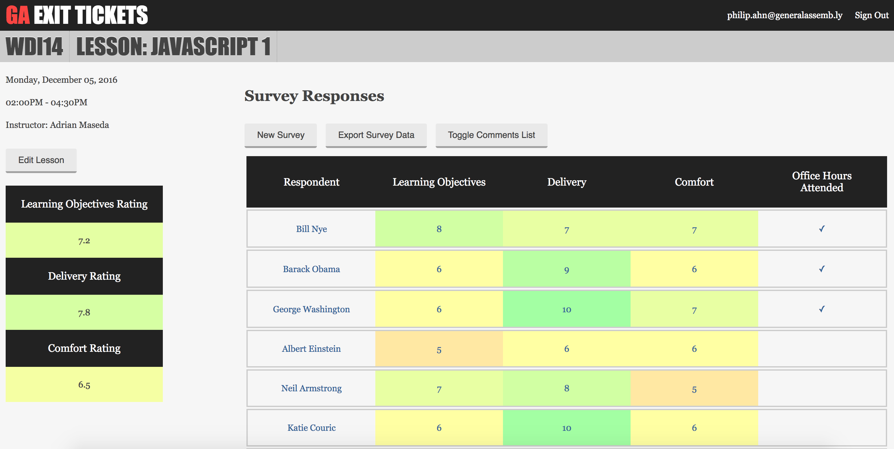

# GA Exit Tickets
An application for collecting and analyzing student surveys that provides course producers an efficient way to track student satisfaction and instructor performance across many concurrently running courses



## Current Features
- Users can create, access, and manage their own courses
- Users can manage other users' access to their courses
- Users can add lessons to their courses and assign users to them
- Users can distribute survey forms to collect lesson feedback
- Student feedback is aggregated and visualized for surveys, lessons, and programs
- Aggregated feedback can be exported to CSV for surveys, lessons, and programs

## Technologies Used
- Ruby on Rails

## Installation Instructions
To set up the app locally on your own system:
1. Fork and clone the [project repository](https://github.com/ga-dc/ga_exit_tickets)
2. Install all dependencies locally  
    ```
    bundle install
    ```
3. Ensure you have [PostgreSQL](https://www.postgresql.org/) installed and running. Then, to set up your database:
    ```
    rails db:create
    rails db:migrate
    ```
4. Lastly, start up your server and navigate to the indicated port number in your browser:
    ```
    rails s
    ```

## Contribute
- Source code: https://github.com/ga-dc/ga_exit_tickets
- Issue Tracker: https://github.com/ga-dc/ga_exit_tickets/issues
